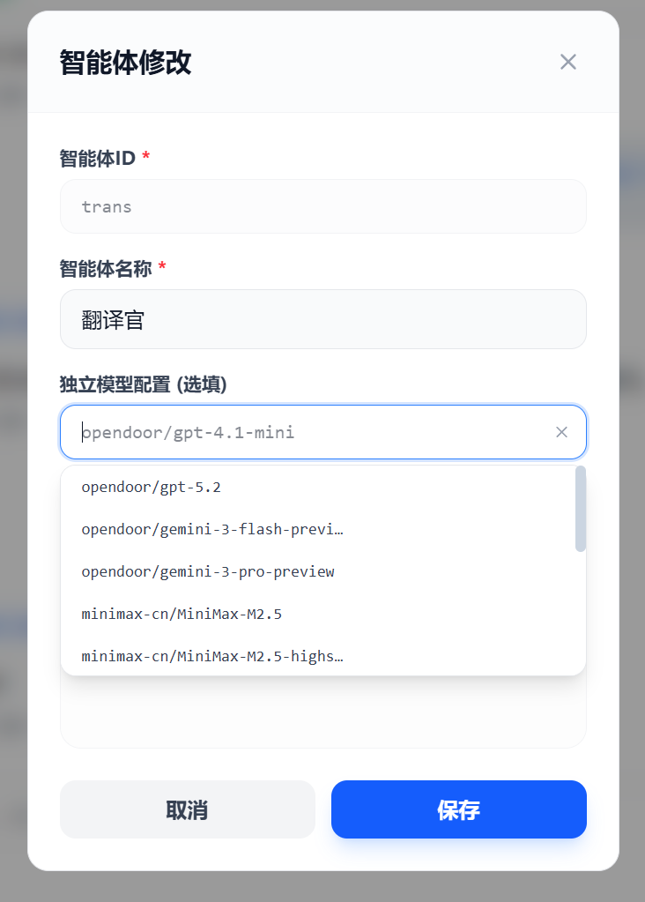
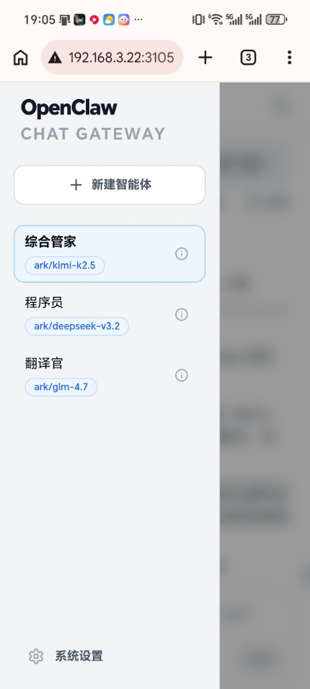

<p align="center">

</p>

# OpenClaw Chat Gateway

**現代化、生產級的 OpenClaw 全功能 Web 客戶端**

[簡體中文](#簡體中文) | [English](#english)

---

## 簡體中文

**OpenClaw Chat Gateway** 是一款專為 OpenClaw 生態打造的生產級 Web 客戶端。它為高級用戶提供了一套完整的“智能體沙盒”管理方案，結合極致的響應式界面，讓您的 OpenClaw 體驗步入全新次元。

### 🌟 核心亮點

- **🤖 多智能體，全 UI 界面配置**：支持多智能體快速創建與管理，通過全 UI 可視化界面完成所有配置邏輯。徹底**告別手動修改 JSON 和 Markdown 文件**。
- **📉 獨立模型配置 & 極大節約 Token**：每個智能體可獨立配置不同的模型，結合完全隔離的工作空間（Workspace）和獨立配置文件，**精準控制模型分流，極大減少了由于背景重疊導致的 Token 浪費**。
- **📱 極致的手機移動端優化**：深度適配移動端屏幕與交互邏輯，響應式設計絲滑順暢，**操作體驗幾乎與原生 APP 無異**。

### ✨ 深度功能
- **🗝️ 智能體完全隔離 (Sandboxing)**：獨立工作區、獨立記憶。每個角色擁有專屬的 `SOUL.md` 和 `USER.md`，徹底告別對話污染。
- **🖼️ 工業級預覽體驗**：集成 LibreOffice 渲染能力，完美支持 Word, PPT, Excel, PDF 等復雜文檔在線預覽，還原真實排版。
- **🚀 深度原生集成**：在對話窗口直接運行 `/status`、`/help` 等底層指令，實時反饋系統狀態。

<p align="center">
  

</p>

### 🚀 快速開始
> [!IMPORTANT]
> 本項目須安裝在安裝了 OpenClaw 的 **Linux 主機**上，且必須是 **原生安裝**（非 Docker）。

#### 📥 一鍵安裝

**默認端口 3115**
```bash
curl -fsSL https://raw.githubusercontent.com/G2OR/OpenClaw-Chat-Gateway/refs/heads/main/install.sh | bash
```

**自定義端口部署 (例如 8080)**
```bash
curl -fsSL https://raw.githubusercontent.com/G2OR/OpenClaw-Chat-Gateway/refs/heads/main/install.sh | bash -s 8080
```

#### 🆙 無損升級
```bash
curl -fsSL https://raw.githubusercontent.com/G2OR/OpenClaw-Chat-Gateway/refs/heads/main/update.sh | bash
```

#### 🗑️ 徹底卸載
```bash
curl -fsSL https://raw.githubusercontent.com/G2OR/OpenClaw-Chat-Gateway/refs/heads/main/uninstall.sh | bash
```

---

### 📱 移動端預覽
精心打磨的移動端細節，不僅是響應式，更是沉浸式。

<p align="center">
  
  
</p>

---

### 💡 提示：預覽增強
如果您需要預覽 Word, PPT, Excel 等文檔，請運行以下指令安裝 LibreOffice：
```bash
sudo apt update && sudo apt install libreoffice -y
```

### 💬 社群與支持
- **Telegram 群**: [安格視界 (AngeWorld)](https://t.me/angeworld2024)
- **資源站**: [安格超市 (Ange Market)](https://blog.angeworld.cc/market/)
- **AI 接口**: [芝麻開門 AI 接口](https://ai.opendoor.cn)

---

## English

**OpenClaw Chat Gateway** is a production-grade Web client designed specifically for the OpenClaw ecosystem. It provides a complete "Agent Sandboxing" management solution for advanced users, combined with a cutting-edge responsive interface to take your OpenClaw experience to a new dimension.

### 🌟 Core Highlights

- **🤖 Multi-Agent, Full UI Configuration**: Supports rapid creation and management of multi-agents through a fully visualized UI interface. Say goodbye to **manually editing JSON and Markdown files**.
- **📉 Isolated Model Configuration & Significant Token Savings**: Each agent can be independently configured with different models. Combined with completely isolated Workspaces and independent configuration files, it **precisely controls model routing and significantly reduces Token waste caused by background overlap**.
- **📱 Ultimate Mobile Optimization**: Deeply adapted to mobile screens and interaction logic, with a smooth responsive design. The **user experience is almost indistinguishable from a native app**.

### ✨ In-Depth Features
- **🗝️ Complete Agent Isolation (Sandboxing)**: Independent workspaces and memory. Each character has its own `SOUL.md` and `USER.md`, completely eliminating conversation pollution.
- **🖼️ Industrial-Grade Preview Experience**: Integrated with LibreOffice rendering capabilities, it perfectly supports online previews of complex documents such as Word, PPT, Excel, and PDF, preserving the original layout.
- **🚀 Deep Native Integration**: Run low-level commands like `/status` and `/help` directly in the chat window for real-time system status feedback.

<p align="center">
  
</p>

### 🚀 Quick Start
> [!IMPORTANT]
> This project must be installed on a **Linux host** where OpenClaw is already installed, and it must be a **native installation** (not Docker).

#### 📥 One-Click Installation

**Default port 3115**
```bash
curl -fsSL https://raw.githubusercontent.com/G2OR/OpenClaw-Chat-Gateway/refs/heads/main/install.sh | bash
```

**Custom port deployment (e.g., 8080)**
```bash
curl -fsSL https://raw.githubusercontent.com/G2OR/OpenClaw-Chat-Gateway/refs/heads/main/install.sh | bash -s 8080
```

#### 🆙 Non-Destructive Upgrade
```bash
curl -fsSL https://raw.githubusercontent.com/G2OR/OpenClaw-Chat-Gateway/refs/heads/main/update.sh | bash
```

#### 🗑️ Complete Uninstallation
```bash
curl -fsSL https://raw.githubusercontent.com/G2OR/OpenClaw-Chat-Gateway/refs/heads/main/uninstall.sh | bash
```

---

### 📱 Mobile Preview
Meticulously crafted mobile details, providing not just responsiveness, but immersion.

<p align="center">
  
  
</p>

---

### 💡 Tip: Enhanced Preview
If you need to preview documents like Word, PPT, or Excel, please run the following command to install LibreOffice:
```bash
sudo apt update && sudo apt install libreoffice -y
```

### 💬 Community & Support
- **Telegram Group**: [安格視界 (AngeWorld)](https://t.me/angeworld2024)
- **Resource Site**: [安格超市 (Ange Market)](https://blog.angeworld.cc/market/)
- **AI Interface**: [芝麻開門 AI 接口](https://ai.opendoor.cn)
